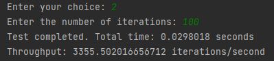
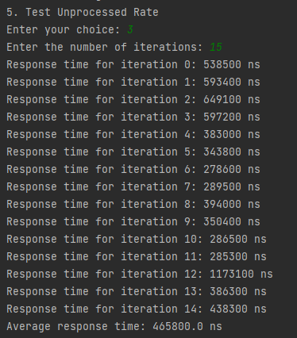
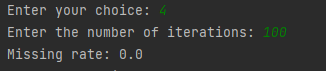
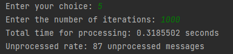

# Hellowold-ice deployment Documentation

****Software Architecture Course****

## Integrants

Juan Jose López López

Sara Cardona Vásquez 

## Separation of tasks

Juan jose → Act as server, modified the original code and added the new factorial methods.

Sara → Act as client, modified the new code and added the quality method measurement tests.

## General description

This project is a client-server communication system based on ice. Tha main goal of this project is that the client interact with the server through a command-line interface.

Also in this project we can find a quality attribute tests for the communication system. These test inclue measuring aspects such as throughput, response time, missing event rate, and unprocessed event rate.

## Usage

1. ****************************************************Initial configuration :**************************************************** SDK 11 java, middleware ice tools downloaded, Gradle 
2. ****************************Compilation :**************************** First run the server then the client

## **Class `Client`**

The **`Client`** class interacts with a server using Ice technology and performs quality attribute tests. It provides an interactive menu that allows sending messages, conducting throughput tests, response time tests, missing event rate tests, and unprocessed event rate tests.

### **Methods**

- **`main(String[] args)`**: Entry point of the program. Initializes communication with the server, displays an interactive menu, and lets the user select tests to execute.
- **`sendMessage(Demo.PrinterPrx twoway, Scanner sc)`**: Sends a custom message to the server and displays the response. Allows the user to write messages or "exit" to quit.
- **`testThroughput(Demo.PrinterPrx twoway, Scanner sc)`**: Conducts throughput tests by simulating a defined number of transactions and calculating throughput in transactions per second.
- 
- **`testResponseTime(Demo.PrinterPrx twoway, Scanner sc)`**: Conducts response time tests by measuring individual response times for a defined number of transactions and calculating the average response time.
- 
- **`testMissingRate(Demo.PrinterPrx twoway, Scanner sc)`**: Performs tests to calculate the missing event rate by monitoring how many events fail to receive a successful response.
- 
- **`testUnprocessedRate(Demo.PrinterPrx twoway, Scanner sc)`**: Performs tests to calculate the unprocessed event rate by simulating the sending of transactions and measuring how many remain pending for processing.
- 
- **`getUsernameAndHostname()`**: Retrieves the username and local host name.

### **Conclusion**
- Given the output values we can conclude that the deployment achieved successfully all the quality attributes presented above.  
## **Class `Server`**

The **`Server`** class is responsible for starting the server using Ice. It creates an object adapter and a **`PrinterI`** object that implements the **`Demo.Printer`** interface to perform operations and display system-related information.

### **Methods**

- **`main(String[] args)`**: Entry point of the program. Initializes the server, creates an object adapter, a **`PrinterI`** object, and activates the adapter.

## **Class `PrinterI`**

The **`PrinterI`** class implements the **`Demo.Printer`** interface and handles processing messages received from the client. It performs operations such as calculating prime factors of a number, listing ports and network interfaces, and executing commands.

### **Methods**

- **`printString(String s, com.zeroc.Ice.Current current)`**: Implements the **`printString`** operation defined in the **`Demo.Printer`** interface. Processes received messages, performs operations based on message content, and displays the corresponding output.
- **`executeCommand(String command)`**: Executes a command in the system and returns the output generated by the command.
- **`primeFactors(int a)`**: Calculates the prime factors of an integer number.